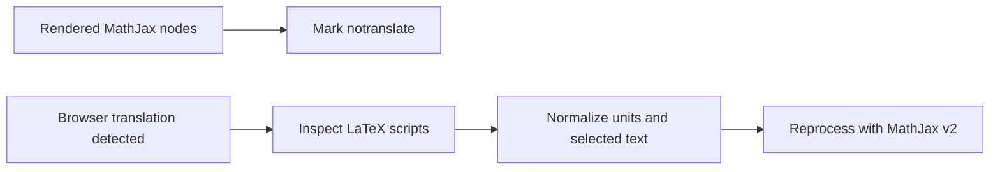

# MathShield

Chrome extension that prevents machine translation from corrupting mathematical notation and repairs recognized translated LaTeX text/units.

[Reproduce the unit repair](scripts/demo.cjs) · [Broader v2 implementation (`test`)](https://github.com/s4m256/math-shield/tree/test)

| Input LaTeX | Output from `main` |
| --- | --- |
| `v = 12\,\mathrm{км}/\mathrm{с}` | `v = 12\,\mathrm{km}/\mathrm{s}` |
| `R = 4\,\mathrm{кОм}` | `R = 4\,\mathrm{k\Omega}` |
| `E = mc^2 + \alpha` | unchanged |

These examples execute the actual transformation functions with no translation service. They show recognized unit normalization, not a simulated browser-translation result.

## Why

Reading a translated physics problem should not require deciphering damaged notation. MathShield separates rendered formulas from prose translation, then repairs selected unit symbols and text commands in the underlying LaTeX.

## How it works



## Technical highlights

- A MutationObserver protects existing and newly inserted `.MathJax`, `.MathJax_Preview` and `.MathJax_Display` nodes.
- Prefix-plus-base-unit matching normalizes selected Cyrillic forms, including `км`, `с` and `кОм`.
- Text handling is restricted to selected LaTeX commands; `\mathrm` is excluded from word translation.
- The MV3 background worker requests MathJax v2 reprocessing in the page's main JavaScript world only after source changes.

## Verification

```bash
node scripts/demo.cjs
node --check content.js
node --check background.js
```

The fixture reports three passing examples, including an unchanged formula. It tests pure transformations, not Chrome's translation UI or an installed extension.

## Installation

Clone this repository, open `chrome://extensions/`, enable Developer mode, choose **Load unpacked**, and select the repository directory. Translate a page containing MathJax v2 source scripts to exercise the runtime flow.

## Current limits and privacy

`main` targets MathJax v2 reprocessing and selected Cyrillic mappings. It does not provide universal MathJax, KaTeX or language support. Regex text extraction does not parse arbitrary nested LaTeX. Browser translation detection relies on `translated-ltr`/`translated-rtl` classes; starting on an already-translated page also exposes an observer-initialization bug in this version.

The current text translation path sends extracted Cyrillic words to `translate.googleapis.com` using the browser language. Failed translations are silently skipped. Review the broad page permissions in [manifest.json](manifest.json) before installing.

The separate [`test` branch](https://github.com/s4m256/math-shield/tree/test) implements a broader parser, a generated locale-aware unit database and browser regression fixtures. Its database validator passed during the audit; that does not certify all locale/engine combinations or make those features part of `main`. No branch was automatically promoted.

## Development note

AI tools were used during development for debugging, brainstorming and the project logo, as disclosed in the previous README.
